# PrestaShop E-commerce Website

PrestaShop B2C e-commerce website requirements covering storefront browsing, shopping cart, checkout, user authentication, and account management.

## REQ-0 Visit Homepage

Visit the homepage of the website.

**Type:** ATOMIC
**Dependencies:** None

**Scenarios:**

- Visit Homepage
  - **GIVEN:** User is in a web browser.
  - **WHEN:** Enter the website URL
  - **THEN:** Display homepage with navigation bar, carousel, and product display area

## REQ-1 Global Navigation

Global navigation bar component at the top of the website, fixed display on all pages. Layout structure (left to right): Logo | Category Menu | Search Box | Language Selector | User Entry | Cart Icon. Navigation bar uses responsive design, collapses to hamburger menu on mobile. 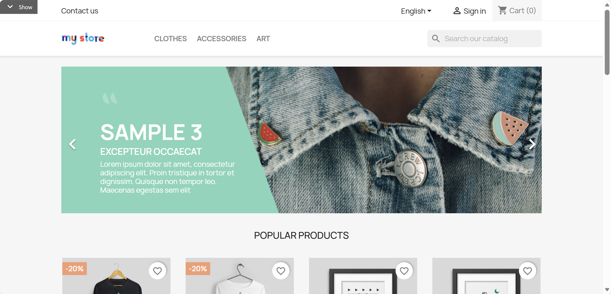

**Type:** FOLDER
**Dependencies:** None

### REQ-1.1 View Global Navigation

View the global navigation bar.

**Type:** ATOMIC
**Dependencies:** REQ-0

**Scenarios:**

- View Global Navigation
  - **GIVEN:** User is on a store page and can see the website header.
  - **WHEN:** Review the navigation area
  - **THEN:** Display Logo, category menu, search box, language selector, user entry, cart icon

### REQ-1.2 Logo Click Returns Home

Click website Logo to return to homepage.

**Type:** ATOMIC
**Dependencies:** None

**Scenarios:**

- Logo Click Returns Home
  - **GIVEN:** User is on any page and can see the website Logo in the header.
  - **WHEN:** Click the website Logo
  - **THEN:** Navigate back to homepage

### REQ-1.3 Category Menu

Horizontally arranged top-level category menu (e.g., CLOTHES, ACCESSORIES, ART). Hover to expand dropdown menu showing subcategories, supports multi-level nesting. The catalog contains the top-level category "CLOTHES" with the subcategories "Men" and "Women".

**Type:** FOLDER
**Dependencies:** None

#### REQ-1.3.1 Expand Category Menu

Expand the category menu to see subcategories.

**Type:** ATOMIC
**Dependencies:** REQ-1.1

**Scenarios:**

- Expand Category Menu
  - **GIVEN:** User can see the category menu in the header.
  - **WHEN:** Hover over a category (e.g., CLOTHES)
  - **THEN:** Expand dropdown menu showing subcategories (e.g., Men, Women)

#### REQ-1.3.2 Enter Subcategory

Click a subcategory to navigate to its product list.

**Type:** ATOMIC
**Dependencies:** REQ-1.3.1

**Scenarios:**

- Enter Subcategory
  - **GIVEN:** The category dropdown menu is expanded.
  - **WHEN:** Click a subcategory link in the dropdown
  - **THEN:** Navigate to the corresponding subcategory product list page

### REQ-1.4 Search Function

Top global search box, supports product keyword search. Real-time search suggestion dropdown displays while typing. Press Enter or click search button to navigate to search results page.  The product search index returns matching products when the keyword "shirt" is entered.

**Type:** ATOMIC
**Dependencies:** None

**Scenarios:**

- Search Function
  - **GIVEN:** User can see the global search box in the header.
  - **WHEN:** Click the search box
  - **THEN:** Search box gains focus
  - **WHEN:** Enter a search keyword (e.g., shirt)
  - **THEN:** Auto-expand search suggestion dropdown
  - **WHEN:** Press Enter or click the search button
  - **THEN:** Navigate to search results page showing matching products

### REQ-1.5 User Entry

User login/register/my account entry link.

**Type:** ATOMIC
**Dependencies:** None

**Scenarios:**

- User Entry
  - **GIVEN:** User can see the user entry link in the header.
  - **WHEN:** Click "Sign in" link
  - **THEN:** Navigate to login page

### REQ-1.6 Cart Icon

Display number of items in cart, click to enter cart page.

**Type:** FOLDER
**Dependencies:** None

#### REQ-1.6.1 View Cart Count

View the number of items in the cart.

**Type:** ATOMIC
**Dependencies:** REQ-1.1

**Scenarios:**

- View Cart Count
  - **GIVEN:** User can see the cart icon in the header.
  - **WHEN:** Review the cart icon
  - **THEN:** Display number of items in cart

#### REQ-1.6.2 Click to Enter Cart

Click the cart icon to navigate to the cart page.

**Type:** ATOMIC
**Dependencies:** REQ-1.6.1

**Scenarios:**

- Click to Enter Cart
  - **GIVEN:** User can see the cart icon in the header.
  - **WHEN:** Click the cart icon
  - **THEN:** Navigate to cart page

## REQ-2 Homepage

Homepage content display, including carousel ads, popular products, promotions, Newsletter subscription, and footer. 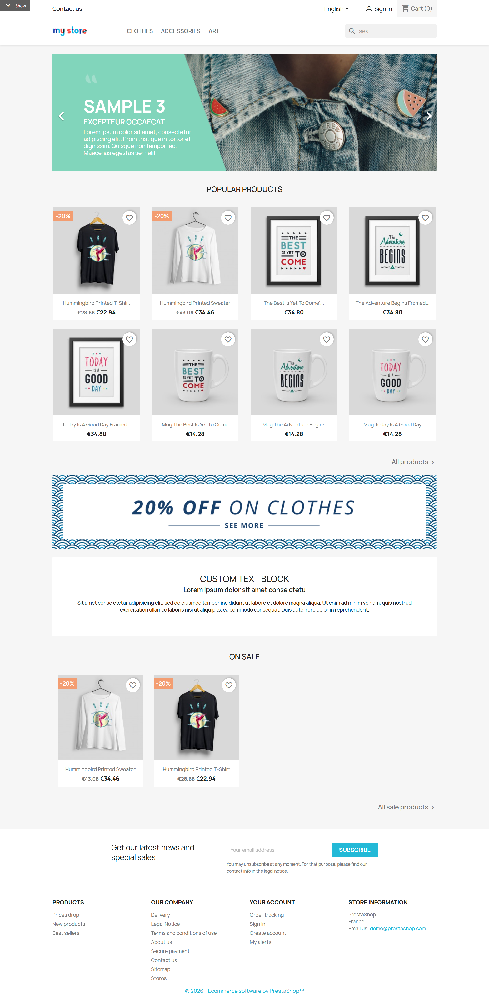

**Type:** FOLDER
**Dependencies:** REQ-1

### REQ-2.1 Browse Homepage

Browse the homepage.

**Type:** ATOMIC
**Dependencies:** REQ-0

**Scenarios:**

- Browse Homepage
  - **GIVEN:** User is on the homepage.
  - **WHEN:** View each area of the homepage
  - **THEN:** Display carousel, Popular Products, promotion area, Newsletter subscription, footer

### REQ-2.2 Carousel Banner

Top carousel area on homepage, displaying promotional information and marketing content.

**Type:** FOLDER
**Dependencies:** None

#### REQ-2.2.1 Carousel Auto Switch

The homepage exposes the promotional carousel as a region or group with an accessible name containing "Carousel". It contains at least two visually different slides and automatically switches to the next slide within five seconds.

**Type:** ATOMIC
**Dependencies:** REQ-2.1

**Scenarios:**

- Carousel Auto Switch
  - **GIVEN:** The homepage carousel is visible.
  - **WHEN:** Wait up to five seconds.
  - **THEN:** The visible carousel content changes to the next visually different slide.

#### REQ-2.2.2 Manual Carousel Switch

Manually switch carousel slide.

**Type:** ATOMIC
**Dependencies:** REQ-2.1

**Scenarios:**

- Manual Carousel Switch
  - **GIVEN:** The homepage carousel is visible.
  - **WHEN:** Click left/right arrow buttons
  - **THEN:** Manually switch carousel slide

#### REQ-2.2.3 Click Carousel to Navigate

Click carousel content to navigate to corresponding marketing page.

**Type:** ATOMIC
**Dependencies:** REQ-2.1

**Scenarios:**

- Click Carousel to Navigate
  - **GIVEN:** The homepage carousel is visible.
  - **WHEN:** Click carousel content
  - **THEN:** Navigate to corresponding marketing page

### REQ-2.3 Popular Products Section

Popular products grid on homepage, containing product cards, quick view, and wishlist functionality. The homepage Popular Products section includes the product "Hummingbird detail t-shirt", and the product card links to its product detail page.

**Type:** ATOMIC
**Dependencies:** None

**Scenarios:**

- Popular Products Section
  - **GIVEN:** User can see the Popular Products section on the homepage.
  - **WHEN:** Click a popular product
  - **THEN:** Navigate to the product detail page.

## REQ-3 Category Page

Product listing page for displaying category products, search results, brand products, and comparable listing contexts. Page layout: Left sidebar filters + Right product grid. Top shows breadcrumb navigation, category title, product count, and sort dropdown. Products displayed in card grid format, supports pagination. 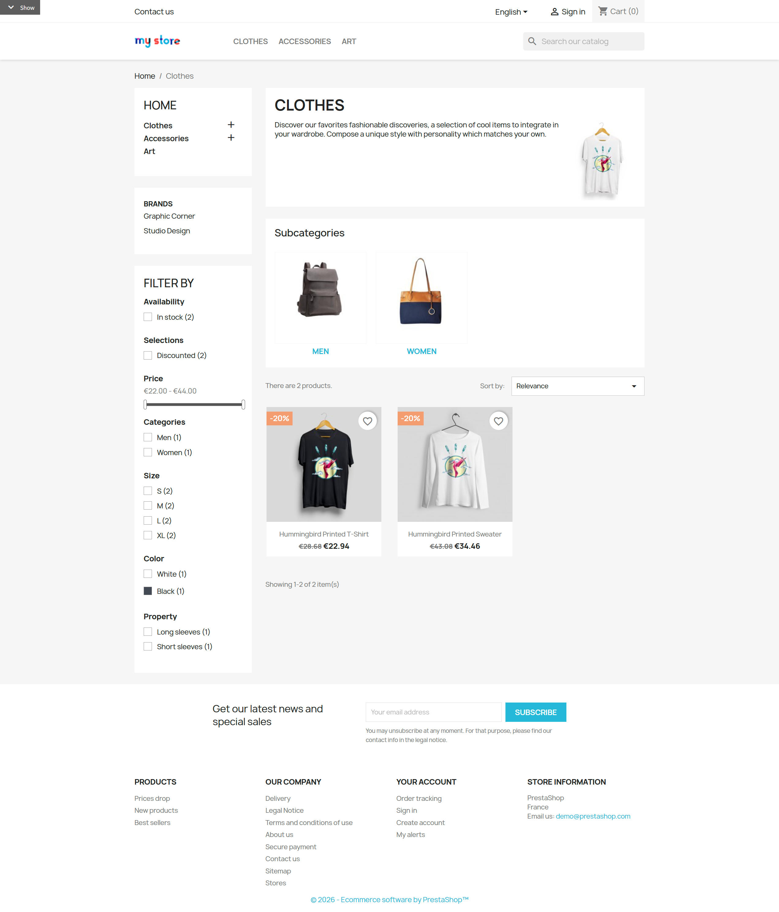 The Men category has at least 13 products across multiple pages, including "Hummingbird detail t-shirt", "Hummingbird cart t-shirt", "Hummingbird checkout-step t-shirt", "Hummingbird order-confirmation t-shirt", "Hummingbird order-complete t-shirt", "Hummingbird order-history t-shirt", "Hummingbird wishlist t-shirt", "White t-shirt", and "Black mug"; these products have stock, color, price, sale, and category attributes suitable for filtering, sorting, and pagination.

**Type:** FOLDER
**Dependencies:** REQ-1

### REQ-3.1 Enter Category Page

Enter a category page.

**Type:** ATOMIC
**Dependencies:** REQ-1.3.1

**Scenarios:**

- Enter Category Page
  - **GIVEN:** User can see the category menu in the header.
  - **WHEN:** Click a product category in navigation menu
  - **THEN:** Navigate to that category's product list page

### REQ-3.2 Breadcrumb Navigation

Display current page hierarchy path, supports returning to parent page.

**Type:** FOLDER
**Dependencies:** None

#### REQ-3.2.1 View Breadcrumb Navigation

View the breadcrumb navigation on a category page.

**Type:** ATOMIC
**Dependencies:** REQ-3.1

**Scenarios:**

- View Breadcrumb Navigation
  - **GIVEN:** User is on a category page.
  - **WHEN:** View breadcrumb navigation
  - **THEN:** Display current page path (e.g., Home > Clothes > Men)

#### REQ-3.2.2 Navigate Back via Breadcrumb

Navigate back to parent category via breadcrumb.

**Type:** ATOMIC
**Dependencies:** REQ-3.2.1

**Scenarios:**

- Navigate Back via Breadcrumb
  - **GIVEN:** Breadcrumb navigation is visible.
  - **WHEN:** Click parent category name in breadcrumb
  - **THEN:** Navigate to parent category page

### REQ-3.3 Category Description

Category description text displayed on category page.

**Type:** ATOMIC
**Dependencies:** None

**Scenarios:**

- Category Description
  - **GIVEN:** User is on a category page.
  - **WHEN:** View top of page
  - **THEN:** Display category name and description text

### REQ-3.4 Subcategory Navigation

Quick entry links to subcategories under current category.

**Type:** ATOMIC
**Dependencies:** None

**Scenarios:**

- Subcategory Navigation
  - **GIVEN:** User is on a category page and can see subcategory links.
  - **WHEN:** Click a subcategory link
  - **THEN:** Navigate to subcategory product list

### REQ-3.5 Product Grid Display

Display product cards in grid format, including image, name, price, discount label, quick view, wishlist control, and related card actions.

**Type:** FOLDER
**Dependencies:** None

#### REQ-3.5.1 View Product Cards

View product cards in the product grid.

**Type:** ATOMIC
**Dependencies:** REQ-3.1

**Scenarios:**

- View Product Cards
  - **GIVEN:** User is on a category page and can see the product grid.
  - **WHEN:** Review product list area
  - **THEN:** Each product card displays product image, name, price (regular/sale), discount label

#### REQ-3.5.2 Hover to Show Action Buttons

Hover over a product card to show action buttons.

**Type:** ATOMIC
**Dependencies:** REQ-3.5.1

**Scenarios:**

- Hover to Show Action Buttons
  - **GIVEN:** User can see product cards in the product grid.
  - **WHEN:** Hover mouse over a product card
  - **THEN:** Display Quick view button and wishlist button, show color preview if multiple colors available

#### REQ-3.5.3 Click to Enter Detail Page

Click a product card to enter detail page.

**Type:** ATOMIC
**Dependencies:** REQ-3.5.1

**Scenarios:**

- Click to Enter Detail Page
  - **GIVEN:** User can see product cards in the product grid.
  - **WHEN:** Click a product card
  - **THEN:** Navigate to product detail page

### REQ-3.6 Filters

Sidebar filters, supports filtering by availability, on sale, categories, size, color, composition, price, brand, and related product attributes.

**Type:** FOLDER
**Dependencies:** None

#### REQ-3.6.1 Filter by Availability

Filter products by availability. In the Men category, "White t-shirt" is in stock and "Black mug" is out of stock.

**Type:** ATOMIC
**Dependencies:** REQ-3.1

**Scenarios:**

- Filter by Availability
  - **GIVEN:** User can see the sidebar filters on a category page.
  - **WHEN:** Check "In stock" filter option
  - **THEN:** The product list shows the in-stock "White t-shirt" and does not show the out-of-stock "Black mug".

#### REQ-3.6.2 Filter by Color

Filter products by color.

**Type:** ATOMIC
**Dependencies:** REQ-3.1

**Scenarios:**

- Filter by Color
  - **GIVEN:** User can see the sidebar filters on a category page.
  - **WHEN:** Click a color filter option (e.g., White)
  - **THEN:** Product list only shows products in that color

#### REQ-3.6.3 Filter by Price Range

Filter products by price range. The category contains products priced on both sides of a 20-unit threshold so the filter can show matching products with visible currency prices after the user enters that limit.

**Type:** ATOMIC
**Dependencies:** REQ-3.1

**Scenarios:**

- Filter by Price Range
  - **GIVEN:** User can see the sidebar filters on a category page, and the category includes products priced within and outside the chosen range.
  - **WHEN:** Drag price slider to set price range
  - **THEN:** Product list only shows products within price range

#### REQ-3.6.4 Clear All Filters

Clear all applied filters.

**Type:** ATOMIC
**Dependencies:** REQ-3.6.1

**Scenarios:**

- Clear All Filters
  - **GIVEN:** At least one filter is applied on the category page.
  - **WHEN:** Click "Clear all" button
  - **THEN:** Reset all filter conditions, show all products

### REQ-3.7 Sort Function

Product list sort dropdown menu, supports sorting by relevance, sales, name, price, reference. 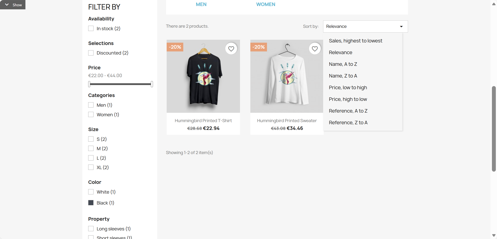

**Type:** ATOMIC
**Dependencies:** None

**Scenarios:**

- Sort Function
  - **GIVEN:** User can see the sort dropdown on a category page.
  - **WHEN:** Click "Sort by" dropdown menu
  - **THEN:** Display sort options list
  - **WHEN:** Select "Price, low to high"
  - **THEN:** Product list re-sorts by price from low to high

### REQ-3.8 Product Count Display

Display total product count under current filter conditions.

**Type:** ATOMIC
**Dependencies:** None

**Scenarios:**

- Product Count Display
  - **GIVEN:** User is on a category page and can see the product list header.
  - **WHEN:** Review product list area
  - **THEN:** Display total product count (e.g., "Showing 1-12 of 18 item(s)")

### REQ-3.9 Pagination

Product list pagination navigation, supports browsing more products by page.

**Type:** ATOMIC
**Dependencies:** None

**Scenarios:**

- Pagination
  - **GIVEN:** User is on a category page with multiple pages of products.
  - **WHEN:** Click next page button or a page number
  - **THEN:** Display next page of products

## REQ-4 Product Detail Page

Single product detailed information page. Page layout: Left image area (main image + thumbnails) + Right info area (name, price, variant selection, add to cart button). Bottom shows product description tabs, review section, related product recommendations. Price and stock dynamically update when selecting different variants.  The product "Hummingbird detail t-shirt" has product images, a description, product details, a regular price, a sale price, a 20% tax rate, related products, and at least one existing review with an average rating.

**Type:** FOLDER
**Dependencies:** REQ-3

### REQ-4.1 Enter Product Detail Page

Enter a product detail page.

**Type:** ATOMIC
**Dependencies:** REQ-3.5.1

**Scenarios:**

- Enter Product Detail Page
  - **GIVEN:** User can see product cards in a category page product grid.
  - **WHEN:** Click any product in product list
  - **THEN:** Navigate to that product's detail page

### REQ-4.2 Product Image Area

Product image display area, including main image, thumbnail switching, and large image viewer.

**Type:** ATOMIC
**Dependencies:** None

**Scenarios:**

- Product Image Area
  - **GIVEN:** User is on a product detail page.
  - **WHEN:** View main image area
  - **THEN:** Display product main image

### REQ-4.3 Product Basic Info

Product basic information display, including name, price (tax incl./excl.), regular price and discount, discount percentage, description. The catalog includes a discounted product with tax information, description text, and a visible 20% discount.

**Type:** ATOMIC
**Dependencies:** None

**Scenarios:**

- Product Basic Info
  - **GIVEN:** User is on a product detail page for a seeded discounted product.
  - **WHEN:** Review product info area
  - **THEN:** Display product name, current price, regular price (if discounted), discount percentage, tax info, product description

### REQ-4.4 Variant Selection

Product variant selector, including size, color, and other attribute selection. The product "Hummingbird detail t-shirt" has a selectable size "M" and color "White", sufficient stock for normal quantities including 3, and stock lower than 999.

**Type:** ATOMIC
**Dependencies:** None

**Scenarios:**

- Variant Selection
  - **GIVEN:** User is on a product detail page and can see the variant selectors.
  - **WHEN:** Click Size dropdown menu to select size
  - **THEN:** Selected size displays in dropdown
  - **WHEN:** Click color swatch to select color
  - **THEN:** Selected color highlights, product image may switch to corresponding color

### REQ-4.5 Quantity Selection

Product quantity selector, supports plus/minus buttons, direct input, and stock warning. The product "Hummingbird detail t-shirt" has a selectable size "M" and color "White", sufficient stock for normal quantities including 3, and stock lower than 999.

**Type:** FOLDER
**Dependencies:** None

#### REQ-4.5.1 Increase Quantity

Increase product quantity.

**Type:** ATOMIC
**Dependencies:** REQ-4.1

**Scenarios:**

- Increase Quantity
  - **GIVEN:** User is on a product detail page and can see the quantity selector.
  - **WHEN:** Click "+" button
  - **THEN:** Quantity increases by 1

#### REQ-4.5.2 Decrease Quantity

Decrease product quantity.

**Type:** ATOMIC
**Dependencies:** REQ-4.5.1

**Scenarios:**

- Decrease Quantity
  - **GIVEN:** User is on a product detail page and can see the quantity selector.
  - **WHEN:** Click "-" button
  - **THEN:** Quantity decreases by 1, minimum is 1

#### REQ-4.5.3 Direct Input Quantity

Directly enter product quantity.

**Type:** ATOMIC
**Dependencies:** REQ-4.1

**Scenarios:**

- Direct Input Quantity
  - **GIVEN:** User is on a product detail page and can see the quantity selector.
  - **WHEN:** Directly enter number in quantity input box
  - **THEN:** Quantity updates to entered value

#### REQ-4.5.4 Stock Insufficient Warning

Display warning when entered quantity exceeds stock.

**Type:** ATOMIC
**Dependencies:** REQ-4.1

**Scenarios:**

- Stock Insufficient Warning
  - **GIVEN:** User is on a product detail page and can see the quantity selector.
  - **WHEN:** Enter quantity exceeding stock
  - **THEN:** Display stock insufficient warning message

### REQ-4.6 Add to Cart

Add product to cart functionality, includes success modal, continue shopping, and proceed to checkout options. 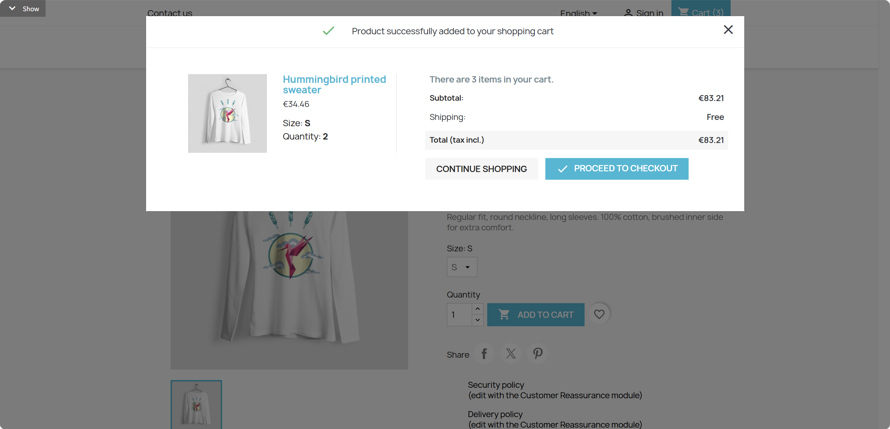 The product "Hummingbird cart t-shirt" is published, purchasable, and has a default available combination with sufficient stock for cart operations.

**Type:** FOLDER
**Dependencies:** REQ-4.4, REQ-4.5

#### REQ-4.6.1 Add Product to Cart

Add a product to the cart.

**Type:** ATOMIC
**Dependencies:** REQ-4.4

**Scenarios:**

- Add Product to Cart
  - **GIVEN:** User is on a product detail page with a selected variant and quantity.
  - **WHEN:** Click "ADD TO CART" button
  - **THEN:** Pop up success modal showing "Product successfully added to your shopping cart"

#### REQ-4.6.2 Continue Shopping After Add

Continue shopping after adding product to cart.

**Type:** ATOMIC
**Dependencies:** REQ-4.6.1

**Scenarios:**

- Continue Shopping After Add
  - **GIVEN:** The add-to-cart success modal is visible.
  - **WHEN:** Click "Continue shopping" button
  - **THEN:** Close modal, return to current product page to continue browsing

#### REQ-4.6.3 Proceed to Checkout After Add

Proceed to checkout after adding product to cart.

**Type:** ATOMIC
**Dependencies:** REQ-4.6.1

**Scenarios:**

- Proceed to Checkout After Add
  - **GIVEN:** The add-to-cart success modal is visible.
  - **WHEN:** Click "Proceed to checkout" button
  - **THEN:** Navigate to cart page

### REQ-4.7 Add to Wishlist

Add product to user wishlist (requires login).

**Type:** ATOMIC
**Dependencies:** None

**Scenarios:**

- Add to Wishlist
  - **GIVEN:** User is on a product detail page.
  - **WHEN:** Click wishlist button
  - **THEN:** If logged in, product added to wishlist with confirmation; if not logged in, prompt to login

### REQ-4.8 Product Description Tabs

Tabs at bottom of product detail, including Description and Product Details (reference, data sheet, features).

**Type:** FOLDER
**Dependencies:** None

#### REQ-4.8.1 View Description Tab

View the product description tab.

**Type:** ATOMIC
**Dependencies:** REQ-4.1

**Scenarios:**

- View Description Tab
  - **GIVEN:** User is on a product detail page and can see the product tabs.
  - **WHEN:** Click "Description" tab
  - **THEN:** Display detailed product description text

#### REQ-4.8.2 View Product Details Tab

View the product details tab.

**Type:** ATOMIC
**Dependencies:** REQ-4.1

**Scenarios:**

- View Product Details Tab
  - **GIVEN:** User is on a product detail page and can see the product tabs.
  - **WHEN:** Click "Product Details" tab
  - **THEN:** Display product specifications table (reference, data sheet, specific features)

### REQ-4.9 Product Reviews

Product review functionality, including review list, rating display, and add review (requires login).

**Type:** FOLDER
**Dependencies:** None

#### REQ-4.9.1 View Review List

View the product review list.

**Type:** ATOMIC
**Dependencies:** REQ-4.1

**Scenarios:**

- View Review List
  - **GIVEN:** User is on a product detail page.
  - **WHEN:** Scroll to review area
  - **THEN:** Display review list and average rating

#### REQ-4.9.2 Add Review

Add a review for the product.

**Type:** ATOMIC
**Dependencies:** REQ-4.9.1

**Scenarios:**

- Add Review
  - **GIVEN:** User can see the review section on a product detail page.
  - **WHEN:** Click add review button
  - **THEN:** If logged in, display review form; if not logged in, prompt to login

### REQ-4.10 Recently Viewed

Display user's recently viewed products.

**Type:** ATOMIC
**Dependencies:** None

**Scenarios:**

- Recently Viewed
  - **GIVEN:** User is on a product detail page.
  - **WHEN:** Scroll to page bottom
  - **THEN:** Display recently viewed products list

### REQ-4.11 Related Products

Recommend other products in the same category.

**Type:** ATOMIC
**Dependencies:** None

**Scenarios:**

- Related Products
  - **GIVEN:** User is on a product detail page.
  - **WHEN:** Scroll to recommendations area
  - **THEN:** Display related products from same category

## REQ-5 Shopping Cart

Shopping cart page, displaying products user has added. List includes: product image, name, variant, unit price, quantity (editable), subtotal, delete button. Right side shows summary: items subtotal, shipping fee, discount, total (tax incl.). Price updates in real-time after quantity modification. 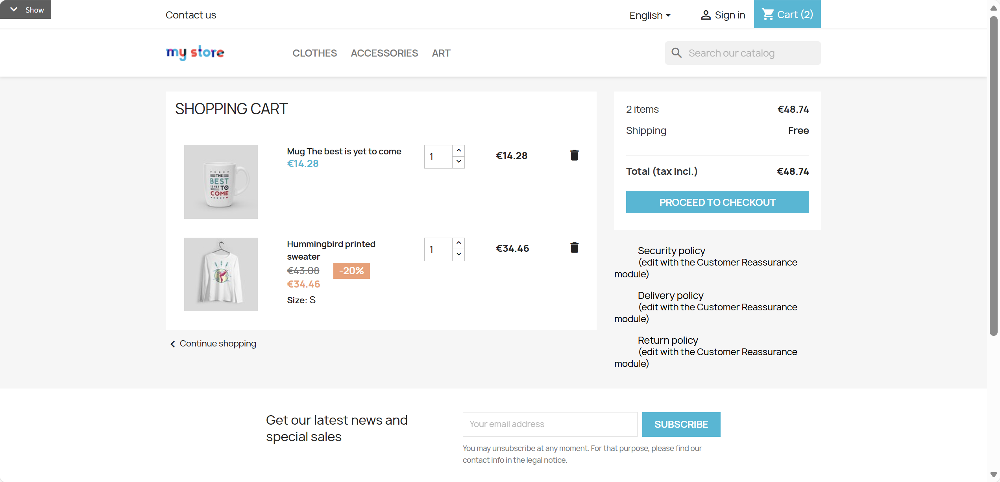

**Type:** FOLDER
**Dependencies:** REQ-4.6

### REQ-5.1 Enter Cart

Enter the shopping cart page.

**Type:** ATOMIC
**Dependencies:** REQ-4.6.1

**Scenarios:**

- Enter Cart
  - **GIVEN:** User has at least one product in the cart.
  - **WHEN:** Click top cart icon or "Proceed to checkout" in add to cart modal
  - **THEN:** Navigate to cart page

### REQ-5.2 Cart Product List

Product list display in cart, including image, name, variant, unit price, quantity, subtotal, and delete button.

**Type:** ATOMIC
**Dependencies:** None

**Scenarios:**

- Cart Product List
  - **GIVEN:** User is on the cart page.
  - **WHEN:** Review cart product list
  - **THEN:** Each product displays image, name, variant (Size, Color), unit price, quantity, subtotal, delete button

### REQ-5.3 Modify Product Quantity

Modify product quantity in cart.

**Type:** ATOMIC
**Dependencies:** None

**Scenarios:**

- Modify Product Quantity
  - **GIVEN:** User is on the cart page and can see a product row.
  - **WHEN:** Click product quantity up/down arrows
  - **THEN:** Product quantity updates, subtotal and total automatically recalculate

### REQ-5.4 Delete Product

Delete product from cart.

**Type:** ATOMIC
**Dependencies:** None

**Scenarios:**

- Delete Product
  - **GIVEN:** User is on the cart page and can see a product row.
  - **WHEN:** Click delete icon on product row
  - **THEN:** Product removed from cart, total recalculates

### REQ-5.5 Cart Summary

Price summary area on cart page, showing items subtotal, shipping fee, discount amount, and total.

**Type:** ATOMIC
**Dependencies:** None

**Scenarios:**

- Cart Summary
  - **GIVEN:** User is on the cart page.
  - **WHEN:** Review cart summary area
  - **THEN:** Display items subtotal, shipping fee, discount amount (if any), total (tax incl.)

### REQ-5.6 Continue Shopping Link

Return to product browsing page to continue shopping. 

**Type:** ATOMIC
**Dependencies:** None

**Scenarios:**

- Continue Shopping Link
  - **GIVEN:** User is on the cart page.
  - **WHEN:** Click "Continue shopping" link
  - **THEN:** Return to product list or homepage

### REQ-5.7 Proceed to Checkout Button

Enter checkout flow.

**Type:** ATOMIC
**Dependencies:** None

**Scenarios:**

- Proceed to Checkout Button
  - **GIVEN:** User is on the cart page.
  - **WHEN:** Click "PROCEED TO CHECKOUT" button
  - **THEN:** Enter checkout flow

## REQ-6 Checkout Flow

Multi-step checkout flow, using single-page multi-step form design. Step order: 1.Personal Information → 2.Addresses → 3.Shipping Method → 4.Payment → 5.Order Confirmation. Left side shows step progress, right side shows order summary and price total. Each step auto-collapses after completion, can click to edit completed steps. 

**Type:** FOLDER
**Dependencies:** REQ-5

### REQ-6.1 Start Checkout

Start the checkout flow. The product "Hummingbird checkout-step t-shirt" is published, purchasable, and has a default available combination with sufficient stock for checkout-step scenarios.

**Type:** ATOMIC
**Dependencies:** REQ-5.7

**Scenarios:**

- Start Checkout
  - **GIVEN:** User is on the cart page.
  - **WHEN:** Click checkout button from cart
  - **THEN:** Enter checkout flow first step

### REQ-6.2 Personal Information Step

Checkout flow first step, logged-in users see their info, non-logged users can login/register/guest checkout.  The system contains a separate verified customer account for checkout information with email "prestashop_checkout_user@example.com" and password "ShopPass123!".

**Type:** ATOMIC
**Dependencies:** None

**Scenarios:**

- Personal Information Step
  - **GIVEN:** User is on checkout personal information step and is logged in.
  - **WHEN:** View personal information
  - **THEN:** Display current user's personal information summary
  - **GIVEN:** User is on checkout personal information step and is not logged in.
  - **WHEN:** Select login/register/guest checkout
  - **THEN:** Navigate to corresponding form based on selection

### REQ-6.3 Addresses Step

Select or add shipping address, supports selecting existing address, adding new address, editing address, and setting invoice address. 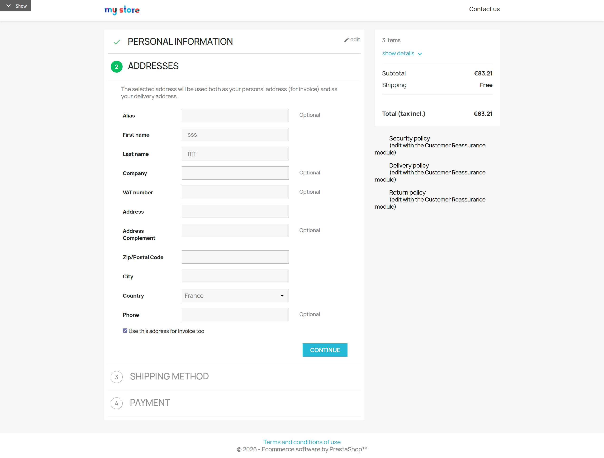

**Type:** FOLDER
**Dependencies:** None

#### REQ-6.3.1 Select Existing Address

Select an existing shipping address. The system contains a separate verified customer account for selecting an existing checkout address with email "prestashop_checkout_address_user@example.com" and password "ShopPass123!". The prestashop_checkout_address_user account has a valid default address with alias "Home".

**Type:** ATOMIC
**Dependencies:** REQ-6.2

**Scenarios:**

- Select Existing Address
  - **GIVEN:** User is on checkout addresses step.
  - **WHEN:** Select an existing address
  - **THEN:** Address is selected and highlighted

#### REQ-6.3.2 Add New Address

Add a new shipping address. The system contains a separate verified customer account for adding a checkout address with email "prestashop_checkout_new_address_user@example.com" and password "ShopPass123!". The country selector contains the country "China".

**Type:** ATOMIC
**Dependencies:** REQ-6.2

**Scenarios:**

- Add New Address
  - **GIVEN:** User is on checkout addresses step.
  - **WHEN:** Click "add new address"
  - **THEN:** Display address form

#### REQ-6.3.3 Set Invoice Address

Set the invoice address. The system contains a separate verified customer account for setting an invoice address with email "prestashop_checkout_invoice_user@example.com" and password "ShopPass123!". The prestashop_checkout_invoice_user account has a valid address available for the shipping and invoice-address flow.

**Type:** ATOMIC
**Dependencies:** REQ-6.3.1

**Scenarios:**

- Set Invoice Address
  - **GIVEN:** User is on checkout addresses step.
  - **WHEN:** Set invoice address (same as shipping/different)
  - **THEN:** Use same address or display invoice address form based on selection

### REQ-6.4 Shipping Method Step

Select shipping method, display shipping cost. 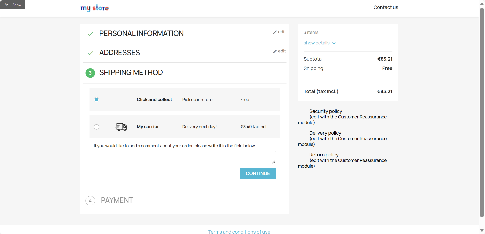 The store has at least one available shipping method named "delivery" or "pick up" with a shipping cost and estimated delivery time.

**Type:** ATOMIC
**Dependencies:** REQ-6.3.1

**Scenarios:**

- Shipping Method Step
  - **GIVEN:** User is on checkout shipping method step.
  - **WHEN:** View available shipping methods
  - **THEN:** Display shipping method list with name, cost, estimated delivery time
  - **WHEN:** Select a shipping method
  - **THEN:** Shipping method is selected, order total updates

### REQ-6.5 Payment Step

Select payment method, agree to terms before placing order. 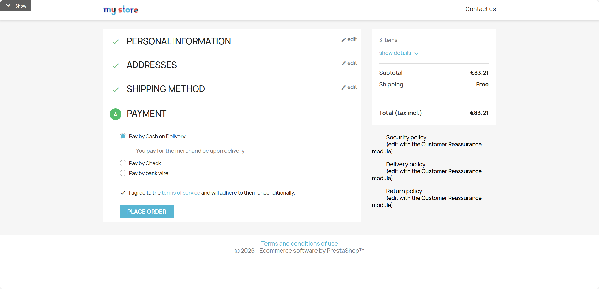 The store has an available payment method named "bank wire" or "pay by check". The checkout payment step contains an available terms-and-conditions agreement that can be checked and opened.

**Type:** ATOMIC
**Dependencies:** REQ-6.4

**Scenarios:**

- Payment Step
  - **GIVEN:** User is on checkout payment step.
  - **WHEN:** View available payment methods
  - **THEN:** Display payment method list
  - **WHEN:** Select a payment method
  - **THEN:** Payment method is selected
  - **WHEN:** Check agree to terms checkbox
  - **THEN:** Terms checkbox is checked
  - **WHEN:** Click to view terms details
  - **THEN:** Pop up or navigate to display terms content

### REQ-6.6 Order Confirmation

Confirm order information and complete order, navigate to order complete page. 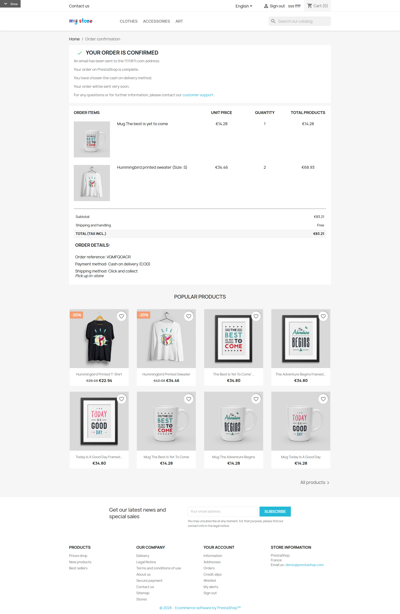 The system contains a separate verified customer account for the order-confirmation checkout flow with email "prestashop_checkout_6_6_user@example.com" and password "ShopPass123!". The product "Hummingbird order-confirmation t-shirt" is published, purchasable, and has a default available combination with stock sufficient for one order. The prestashop_checkout_6_6_user account has a valid default address available for completing the REQ-6.6 order-confirmation checkout flow.

**Type:** ATOMIC
**Dependencies:** REQ-6.5

**Scenarios:**

- Order Confirmation
  - **GIVEN:** User is on checkout order confirmation step.
  - **WHEN:** Click order confirmation button
  - **THEN:** Order created successfully, navigate to order complete page

### REQ-6.7 Order Complete Page

Confirmation page after order successfully created, displaying order reference, order details, and continue shopping link.  The system contains a separate verified customer account for the completed-order checkout flow with email "prestashop_checkout_6_7_user@example.com" and password "ShopPass123!". The product "Hummingbird order-complete t-shirt" is published, purchasable, and has a default available combination with stock sufficient for one order. The prestashop_checkout_6_7_user account has a valid default address available for completing the REQ-6.7 order-complete checkout flow.

**Type:** ATOMIC
**Dependencies:** REQ-6.6

**Scenarios:**

- Order Complete Page
  - **GIVEN:** User is on the order complete page.
  - **WHEN:** View order complete page
  - **THEN:** Display order reference, order details summary
  - **WHEN:** Click continue shopping link
  - **THEN:** Return to homepage or product list

## REQ-7 User Authentication

User authentication module, including login, registration, forgot password functionality. Login page layout: Left login form + Right registration entry. Supports remember me, password show/hide toggle. 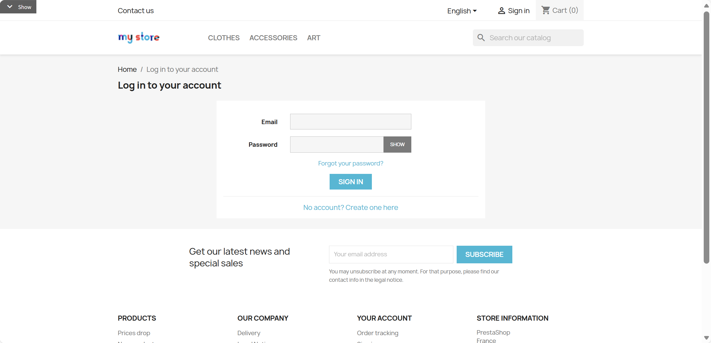

**Type:** FOLDER
**Dependencies:** REQ-1

### REQ-7.1 Enter Login Page

Enter the user login page.

**Type:** ATOMIC
**Dependencies:** REQ-1.5

**Scenarios:**

- Enter Login Page
  - **GIVEN:** User can see the user entry link in the header.
  - **WHEN:** Click top navigation "Sign in" link
  - **THEN:** Navigate to login page

### REQ-7.2 User Login

Login form, including email, password input, show/hide password, remember me option.  The system contains a verified customer account with email "prestashop_user@example.com", password "ShopPass123!", first name "Store", last name "User", and birthdate "1995-08-21".

**Type:** ATOMIC
**Dependencies:** REQ-7.1

**Scenarios:**

- User Login
  - **GIVEN:** User is on the login page and can see the login form.
  - **WHEN:** Enter email address in Email input box
  - **THEN:** Email is entered
  - **WHEN:** Enter password in Password input box
  - **THEN:** Password displays as masked characters
  - **WHEN:** Click "SHOW" button
  - **THEN:** Password toggles to plain text display
  - **WHEN:** Check "Remember me"
  - **THEN:** Remember me is checked
  - **WHEN:** Click "SIGN IN" button
  - **THEN:** If credentials correct, login success, navigate to my account or previous page; otherwise display error message

### REQ-7.3 User Registration

New user registration form, including social title, name, email, password, birthday, subscription options, and terms agreement. The birthday field accepts a valid calendar date entered in yyyy-mm-dd form, such as 1995-08-21, and stores it as part of the customer profile. 

**Type:** ATOMIC
**Dependencies:** REQ-7.1

**Scenarios:**

- User Registration
  - **GIVEN:** User is on the login page.
  - **WHEN:** Click "No account? Create one here" link
  - **THEN:** Display registration form
  - **GIVEN:** Registration form is visible.
  - **WHEN:** Select social title (Mr. / Mrs.)
  - **THEN:** Title is selected
  - **WHEN:** Fill in First name and Last name
  - **THEN:** Names are filled
  - **WHEN:** Fill in Email address
  - **THEN:** Email is filled
  - **WHEN:** Fill in Password
  - **THEN:** Password is filled
  - **WHEN:** Fill in Birthdate
  - **THEN:** Birthdate is filled
  - **WHEN:** Optionally check receive offers email and subscribe to Newsletter
  - **THEN:** Options are checked
  - **WHEN:** Check agree to terms (required)
  - **THEN:** Terms are agreed
  - **WHEN:** Click "SAVE" button
  - **THEN:** Registration success, auto login and navigate to my account page

### REQ-7.4 Forgot Password

Forgot password functionality, sends password reset email. 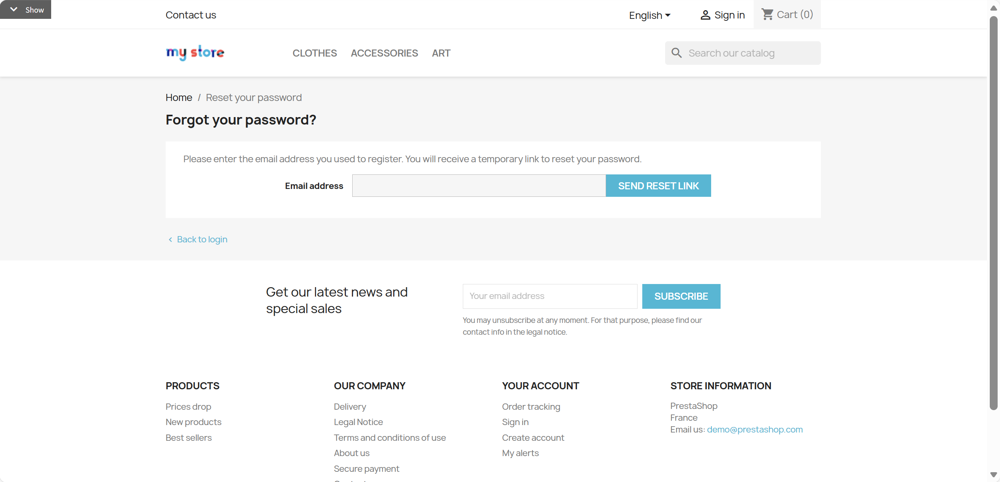

**Type:** ATOMIC
**Dependencies:** REQ-7.1

**Scenarios:**

- Forgot Password
  - **GIVEN:** User is on the login page.
  - **WHEN:** Click "Forgot your password?" link
  - **THEN:** Navigate to password reset page
  - **GIVEN:** User is on the password reset page.
  - **WHEN:** Enter registered email
  - **THEN:** Email is entered
  - **WHEN:** Click send button
  - **THEN:** Display email sent success message

## REQ-8 My Account

User personal account management center, accessible after login. Page layout: Left function menu + Right content area. Features include: Account overview, personal info editing, address management, order history, wishlist management, logout. 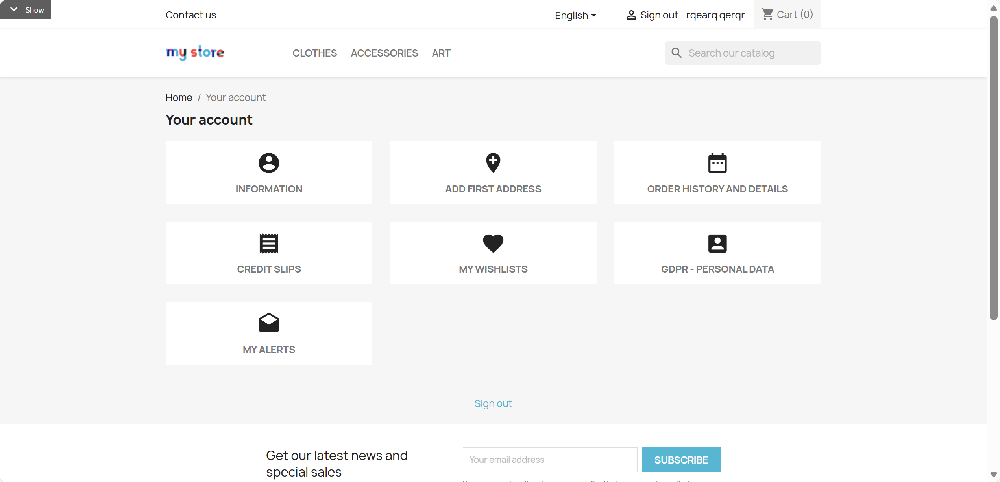

**Type:** FOLDER
**Dependencies:** REQ-7.2

### REQ-8.1 Enter My Account

Enter My Account page.

**Type:** ATOMIC
**Dependencies:** REQ-7.2

**Scenarios:**

- Enter My Account
  - **GIVEN:** User is logged in and can see the account entry.
  - **WHEN:** Click username or "My account" link
  - **THEN:** Navigate to my account page

### REQ-8.2 Account Overview

Account homepage, displaying user info summary and quick entry to each function. 

**Type:** ATOMIC
**Dependencies:** REQ-8.1

**Scenarios:**

- Account Overview
  - **GIVEN:** User is on My Account page.
  - **WHEN:** View account overview page
  - **THEN:** Display user info summary and function entries (orders, addresses, information and related account entries.)

### REQ-8.3 Account Information Management

Modify personal information and password. 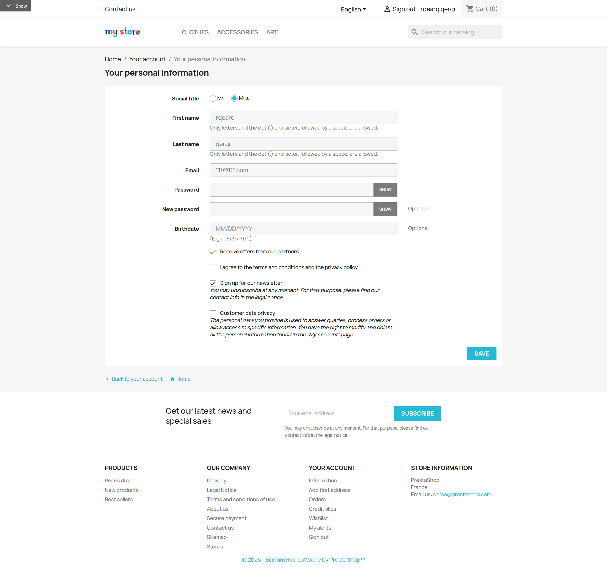 The system contains a separate verified customer account for profile editing with email "prestashop_profile_user@example.com" and password "ShopPass123!".

**Type:** ATOMIC
**Dependencies:** REQ-8.1

**Scenarios:**

- Account Information Management
  - **GIVEN:** User is on My Account page.
  - **WHEN:** Click "Information" link
  - **THEN:** Enter account information edit page
  - **GIVEN:** User is on account information edit page.
  - **WHEN:** Modify personal information and save
  - **THEN:** Information updated successfully
  - **WHEN:** Modify password and save
  - **THEN:** Password updated successfully

### REQ-8.4 Address Management

Manage shipping addresses, including view list, add, edit, and delete addresses. 

**Type:** FOLDER
**Dependencies:** None

#### REQ-8.4.1 View Address List

View the list of addresses. The system contains a separate verified customer account for viewing addresses with email "prestashop_address_view_user@example.com" and password "ShopPass123!". The prestashop_address_view_user account has a valid address with alias "Home".

**Type:** ATOMIC
**Dependencies:** REQ-8.1

**Scenarios:**

- View Address List
  - **GIVEN:** User is on My Account page.
  - **WHEN:** Click "Addresses" link
  - **THEN:** Display address list page

#### REQ-8.4.2 Add New Address

Add a new address. The system contains a separate verified customer account for creating an address with email "prestashop_address_create_user@example.com" and password "ShopPass123!". The country selector contains the country "China". The prestashop_address_create_user account has an initially empty address book.

**Type:** ATOMIC
**Dependencies:** REQ-8.4.1

**Scenarios:**

- Add New Address
  - **GIVEN:** User is on address list page.
  - **WHEN:** Click "Create new address" button
  - **THEN:** Display address form
  - **GIVEN:** Address form is visible.
  - **WHEN:** Fill in address info (Alias, First name, Last name, Address, Zip/Postal code, City, Country, Phone)
  - **THEN:** Form filled
  - **WHEN:** Click "SAVE" button
  - **THEN:** New address added successfully, return to address list

#### REQ-8.4.3 Edit Address

Edit an existing address. The system contains a separate verified customer account for editing an address with email "prestashop_address_edit_user@example.com" and password "ShopPass123!". The prestashop_address_edit_user account has a valid editable address with alias "Home".

**Type:** ATOMIC
**Dependencies:** REQ-8.4.1

**Scenarios:**

- Edit Address
  - **GIVEN:** User is on address list page.
  - **WHEN:** Click "Update" button on address card
  - **THEN:** Enter address edit page, display current address info
  - **GIVEN:** User is on address edit page.
  - **WHEN:** Modify address info and click "SAVE"
  - **THEN:** Address updated successfully

#### REQ-8.4.4 Delete Address

Delete an existing address. The system contains a separate verified customer account for deleting an address with email "prestashop_address_delete_user@example.com" and password "ShopPass123!". The prestashop_address_delete_user account has a valid deletable address with alias "Home".

**Type:** ATOMIC
**Dependencies:** REQ-8.4.1

**Scenarios:**

- Delete Address
  - **GIVEN:** User is on address list page.
  - **WHEN:** Click "Delete" button on address card
  - **THEN:** Address deleted, removed from list

### REQ-8.5 Order History

View order history, including order list, status, details, reorder, and download invoice.  The system contains a separate verified customer account with a stable order history with email "prestashop_order_history_user@example.com" and password "ShopPass123!". The prestashop_order_history_user account has at least one completed historical order containing an order reference, date, status, total, product list, shipping information, payment information, and a downloadable PDF invoice.

**Type:** FOLDER
**Dependencies:** None

#### REQ-8.5.1 View Order List

View the list of orders.

**Type:** ATOMIC
**Dependencies:** REQ-8.1

**Scenarios:**

- View Order List
  - **GIVEN:** User is on My Account page.
  - **WHEN:** Click "Order history and details" link
  - **THEN:** Display order list with order reference, date, status, total

#### REQ-8.5.2 View Order Details

View details of an order.

**Type:** ATOMIC
**Dependencies:** REQ-8.5.1

**Scenarios:**

- View Order Details
  - **GIVEN:** User is viewing the order list.
  - **WHEN:** Click "Details" link on an order
  - **THEN:** Expand/display order details with product list, shipping info, payment info

#### REQ-8.5.3 Reorder

Reorder products from a past order. The product "Hummingbird order-history t-shirt" is published, purchasable, and has a default available combination so that a historical order can be reordered. The historical order contains the product "Hummingbird order-history t-shirt", which remains available for reorder and can be added back to the shopping cart.

**Type:** ATOMIC
**Dependencies:** REQ-8.5.1

**Scenarios:**

- Reorder
  - **GIVEN:** User is viewing the order list.
  - **WHEN:** Click "Reorder" button
  - **THEN:** Add order products back to cart

#### REQ-8.5.4 Download Invoice

Download the invoice for an order.

**Type:** ATOMIC
**Dependencies:** REQ-8.5.1

**Scenarios:**

- Download Invoice
  - **GIVEN:** User is viewing the order list.
  - **WHEN:** Click "PDF" invoice download link
  - **THEN:** Download order invoice PDF file

### REQ-8.6 Wishlist Management

Manage wishlists, including view list, create, rename, delete wishlist, and manage products in wishlist.  The product "Hummingbird wishlist t-shirt" is published, purchasable, and has a default available combination for wishlist product operations.

**Type:** FOLDER
**Dependencies:** None

#### REQ-8.6.1 View Wishlist List

View the list of wishlists. The system contains a separate verified customer account for viewing wishlists with email "prestashop_wishlist_view_user@example.com" and password "ShopPass123!". The prestashop_wishlist_view_user account has a wishlist named "Favorites" containing "Hummingbird wishlist t-shirt".

**Type:** ATOMIC
**Dependencies:** REQ-8.1

**Scenarios:**

- View Wishlist List
  - **GIVEN:** User is on My Account page.
  - **WHEN:** Click "Wishlist" link
  - **THEN:** Display wishlist list page

#### REQ-8.6.2 Create New Wishlist

Create a new wishlist. The system contains a separate verified customer account for creating a wishlist with email "prestashop_wishlist_create_user@example.com" and password "ShopPass123!".

**Type:** ATOMIC
**Dependencies:** REQ-8.6.1

**Scenarios:**

- Create New Wishlist
  - **GIVEN:** User is on wishlist list page.
  - **WHEN:** Click "Create new wishlist" button
  - **THEN:** Pop up create modal
  - **GIVEN:** Create wishlist modal is visible.
  - **WHEN:** Enter wishlist name and confirm
  - **THEN:** New wishlist created successfully, displays in list

#### REQ-8.6.3 View Wishlist Products

View products in a wishlist. The prestashop_wishlist_view_user account has a wishlist named "Favorites" containing "Hummingbird wishlist t-shirt".

**Type:** ATOMIC
**Dependencies:** REQ-8.6.1

**Scenarios:**

- View Wishlist Products
  - **GIVEN:** User is on wishlist list page.
  - **WHEN:** Click wishlist name
  - **THEN:** Display products in that wishlist

#### REQ-8.6.4 Rename Wishlist

Rename a wishlist. The system contains a separate verified customer account for renaming a wishlist with email "prestashop_wishlist_rename_user@example.com" and password "ShopPass123!". The prestashop_wishlist_rename_user account has a wishlist named "Favorites" that can be renamed.

**Type:** ATOMIC
**Dependencies:** REQ-8.6.1

**Scenarios:**

- Rename Wishlist
  - **GIVEN:** User is on wishlist list page.
  - **WHEN:** Click wishlist edit/rename button
  - **THEN:** Can edit wishlist name
  - **WHEN:** Enter new name and save
  - **THEN:** Wishlist name updated successfully

#### REQ-8.6.5 Delete Wishlist

Delete a wishlist. The system contains a separate verified customer account for deleting a wishlist with email "prestashop_wishlist_delete_user@example.com" and password "ShopPass123!". The prestashop_wishlist_delete_user account has a deletable wishlist named "Favorites".

**Type:** ATOMIC
**Dependencies:** REQ-8.6.1

**Scenarios:**

- Delete Wishlist
  - **GIVEN:** User is on wishlist list page.
  - **WHEN:** Click wishlist delete button
  - **THEN:** Wishlist deleted, removed from list

#### REQ-8.6.6 Remove Product from Wishlist

Remove a product from a wishlist. The system contains a separate verified customer account for removing a wishlist product with email "prestashop_wishlist_remove_user@example.com" and password "ShopPass123!". The prestashop_wishlist_remove_user account has a wishlist named "Favorites" containing "Hummingbird wishlist t-shirt".

**Type:** ATOMIC
**Dependencies:** REQ-8.6.3

**Scenarios:**

- Remove Product from Wishlist
  - **GIVEN:** User is viewing products in a wishlist.
  - **WHEN:** Click product remove button
  - **THEN:** Product removed from wishlist

#### REQ-8.6.7 Add Wishlist Product to Cart

Add a product from a wishlist to the cart. The system contains a separate verified customer account for adding a wishlist product to the cart with email "prestashop_wishlist_cart_user@example.com" and password "ShopPass123!". The prestashop_wishlist_cart_user account has a wishlist named "Favorites" containing "Hummingbird wishlist t-shirt".

**Type:** ATOMIC
**Dependencies:** REQ-8.6.3

**Scenarios:**

- Add Wishlist Product to Cart
  - **GIVEN:** User is viewing products in a wishlist.
  - **WHEN:** Click product "Add to cart" button
  - **THEN:** Product added to cart

### REQ-8.7 User Logout

Logout from current session. 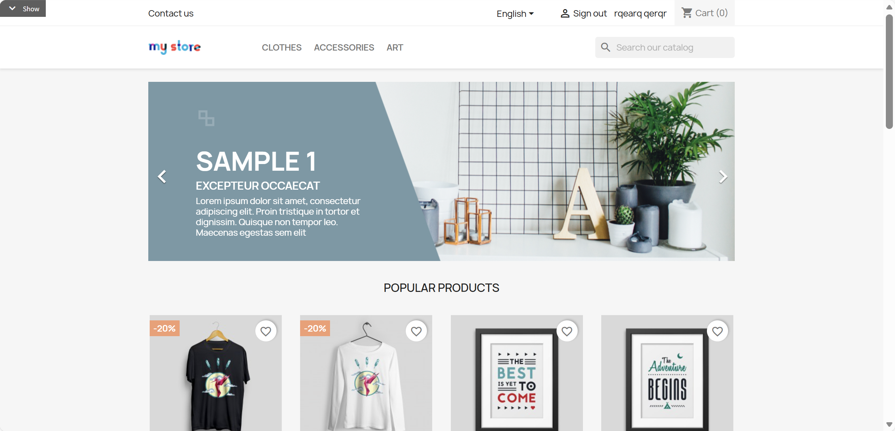

**Type:** ATOMIC
**Dependencies:** REQ-8.1

**Scenarios:**

- User Logout
  - **GIVEN:** User is logged in and can see the 'Sign out' link.
  - **WHEN:** Click "Sign out" link
  - **THEN:** Logout, navigate to homepage or login page
