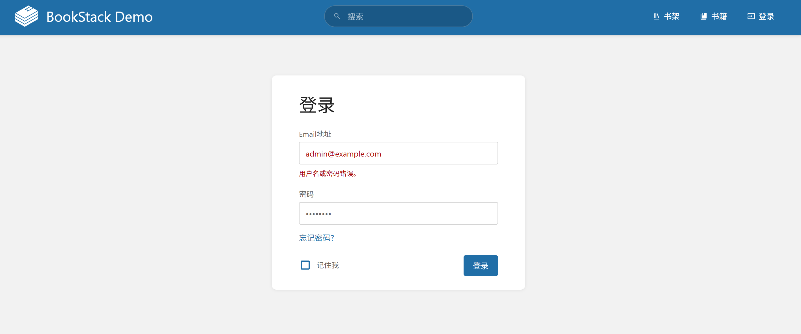
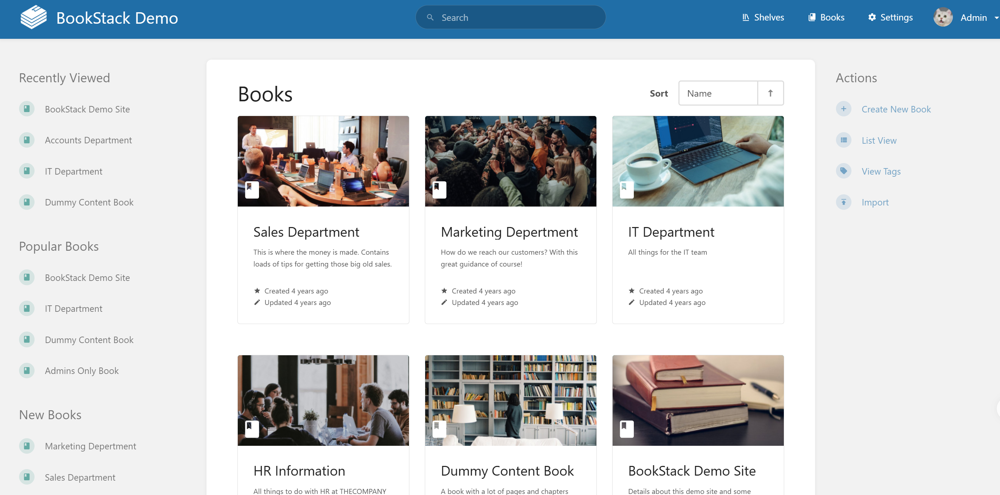
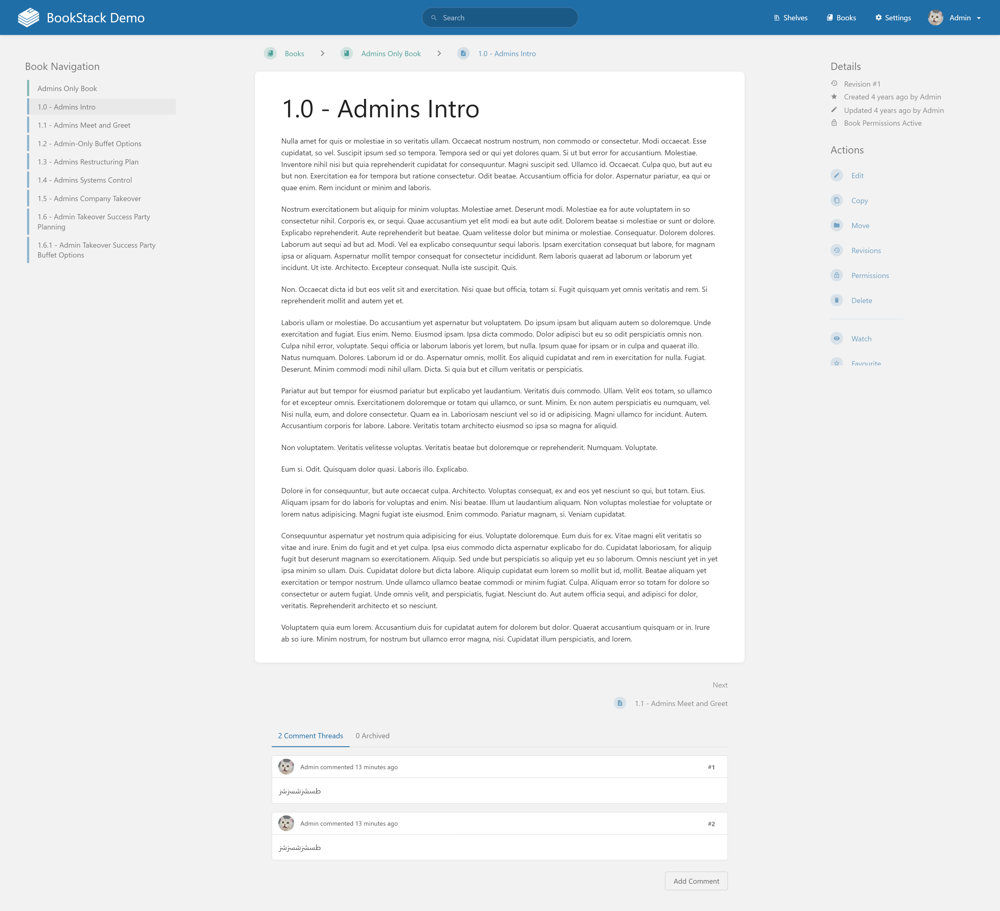
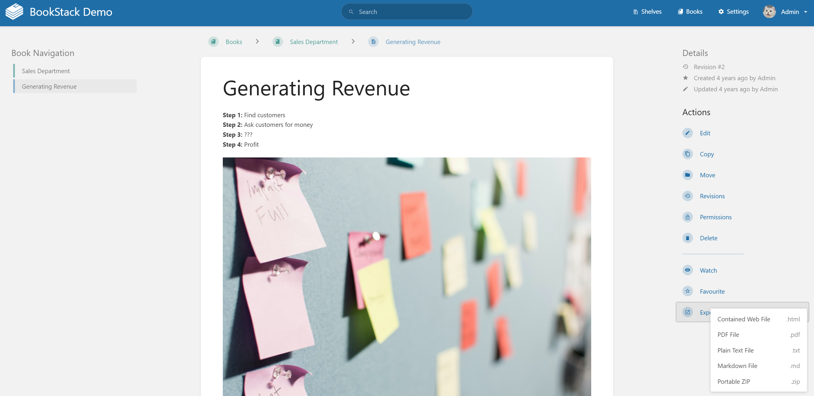
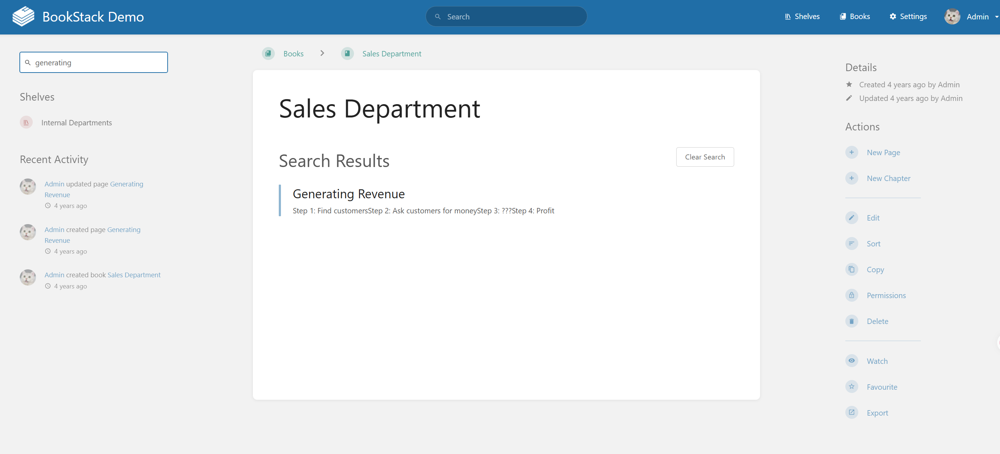
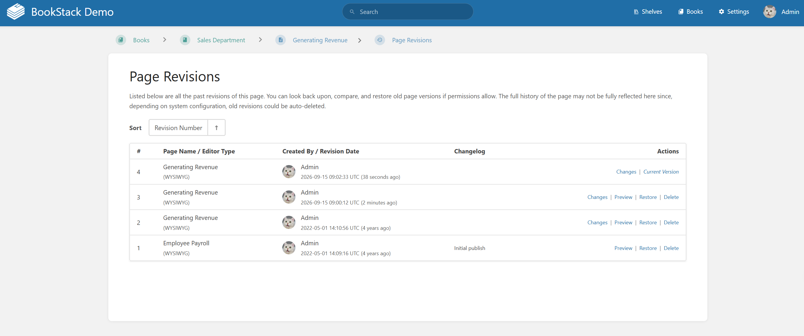

# BookStack Evolution

ARC-Bench-Lite evolution requirements for the BookStack knowledge base system. The task starts from a completed BookStack implementation from ARC-Bench-Lite and applies realistic BookStack behaviors that extend authentication feedback, book organization, page collaboration, export, scoped search, and revision history while preserving existing browsing and reading behavior.

## REQ-10.1 Login failure feedback

Extend the login flow so invalid credentials are handled explicitly. The login form contains the labelled fields `Email address` and `Password`, a `Remember Me` checkbox, and a `Login` button. Reference image: . Seed data: verified account nickname `BookStack User`, email `bookstack_user@example.com`, password `Password123!`; invalid-login test data uses `unknown.bookstack@example.com` and `WrongPassword123!`. If the user submits an unknown email or wrong password, the system must stay on the login page, keep the `Login form` visible, and expose an authentication error with accessible text `Invalid email or password`. The existing successful login behavior with valid credentials must remain unchanged.

**Type:** ATOMIC
**Dependencies:** REQ-2.1

**Scenarios:**

- Reject invalid credentials
  - **GIVEN:** The user is on the login form page.
  - **WHEN:** The user enters unknown.bookstack@example.com and WrongPassword123! in the Email address and Password fields and clicks Login.
  - **THEN:** The Login form remains visible and an alert or status with text Invalid email or password is displayed.

## REQ-10.2 Sort book contents

Extend the book details page so the user can sort the contents of a book. Reference image: . Seed data: book `Evolution Sort Book`, chapter `Beta Chapter`, and page `Alpha Page`; both child entries belong to that book. The action panel must expose a `Sort` or `Reorder` action, allow alphabetical ordering by name, and provide a `Save` or `Apply` action. After saving, the user remains on the same book details page, the book heading remains visible, and the existing page and chapter entries are preserved in the selected order.

**Type:** ATOMIC
**Dependencies:** REQ-5.2.1, REQ-6.1.1, REQ-6.2.1

**Scenarios:**

- Sort pages and chapters inside a book
  - **GIVEN:** The user is viewing Evolution Sort Book, which contains Beta Chapter and Alpha Page.
  - **WHEN:** The user opens Sort or Reorder, selects alphabetical ordering by name, and activates Save or Apply.
  - **THEN:** The Evolution Sort Book details page remains visible and shows both Alpha Page and Beta Chapter after sorting.

## REQ-11.1 Page comments

Add comments to readable pages. Reference image: . Seed data: book `Evolution Comments Book` with readable page `Review Guidelines`. The page must expose a labelled `Comment` textbox and a `Submit comment` or `Add comment` action. A user can submit the exact comment `This page needs review.` and see it in the comment section on the same page. Submitting a comment must not remove the page title or content.

**Type:** ATOMIC
**Dependencies:** REQ-6.3.1

**Scenarios:**

- Add a comment to a page
  - **GIVEN:** The user is reading the Review Guidelines page in Evolution Comments Book.
  - **WHEN:** The user enters This page needs review. in Comment and submits it.
  - **THEN:** This page needs review. appears in the page comments section and Review Guidelines remains readable.

## REQ-11.2 Export book as Markdown

Add a Markdown export option to the book details page. Reference image: . Seed data: book `Evolution Export Book`. The action must be named `Export Markdown` or `Download Markdown`, download a file whose suggested filename ends in `.md`, and keep the user on the same book details page.

**Type:** ATOMIC
**Dependencies:** REQ-5.2.1

**Scenarios:**

- Download book Markdown
  - **GIVEN:** The user is viewing the Evolution Export Book details page.
  - **WHEN:** The user clicks the Markdown export action.
  - **THEN:** The browser receives a Markdown file download for Evolution Export Book and the details page remains available.

## REQ-12.1 Search within a book

Add scoped search inside the current book. Reference image: . Seed data: `Evolution Search Book` contains page `Deployment Guide`, while `Deployment Archive` belongs to another book. The book sidebar must expose a labelled `Search` field. Searching for `Deployment` from `Evolution Search Book` must show `Deployment Guide` and keep the user in the current book context, while not showing `Deployment Archive` from the other book.

**Type:** ATOMIC
**Dependencies:** REQ-5.2.1

**Scenarios:**

- Search child pages inside a book
  - **GIVEN:** The user is viewing Evolution Search Book, which contains Deployment Guide.
  - **WHEN:** The user enters Deployment in the book-level Search field and presses Enter.
  - **THEN:** The system shows Deployment Guide, does not show Deployment Archive, and keeps the user in the Evolution Search Book context.

## REQ-12.2 View page revision history

Add revision history access for readable pages. Reference image: . Seed data: book `Evolution Revisions Book` with page `Release Process` and at least two saved versions, including a visible entry labelled `Revision 2` with timestamp or author metadata. A user can open page actions, choose `Revisions` or `Revision history`, view the versions, and return to the page while preserving its title and content.

**Type:** ATOMIC
**Dependencies:** REQ-6.3.1

**Scenarios:**

- Open revisions for a page
  - **GIVEN:** The user is reading Release Process in Evolution Revisions Book.
  - **WHEN:** The user opens the page actions and chooses Revisions.
  - **THEN:** The system displays revision history including Revision 2 and keeps a Back, Return, or View page action.
