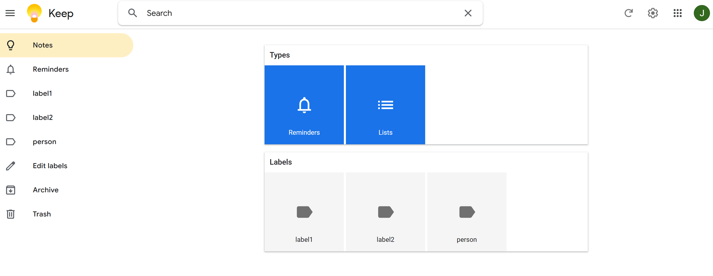
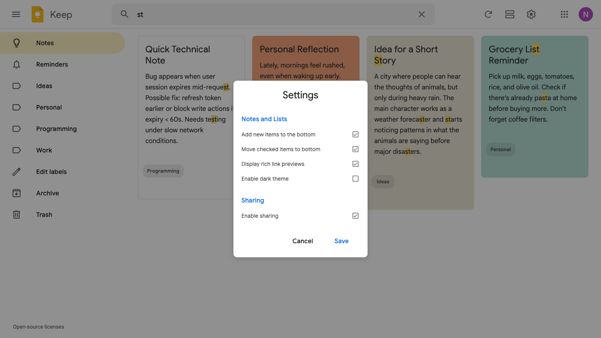
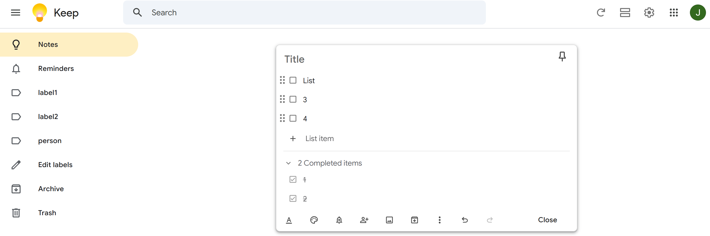
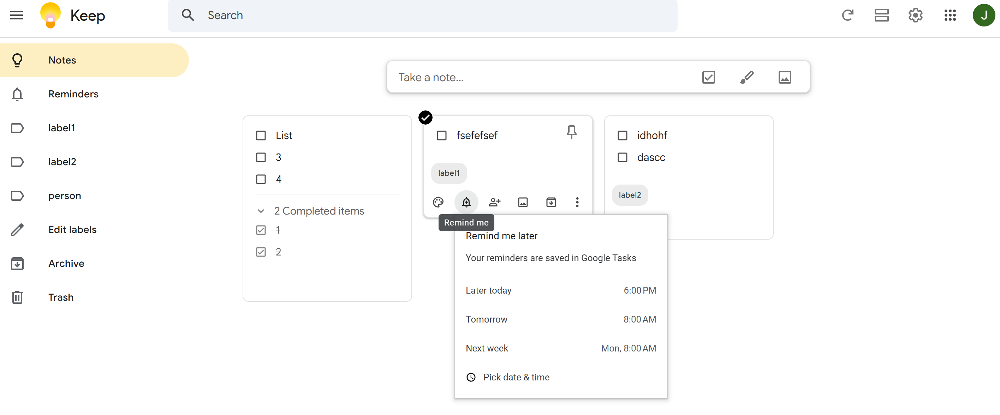
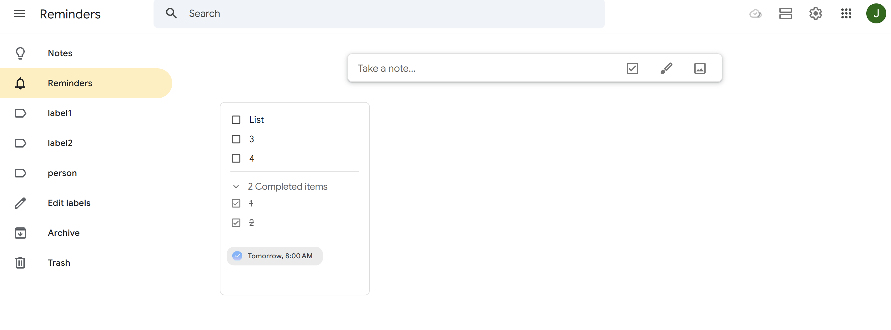
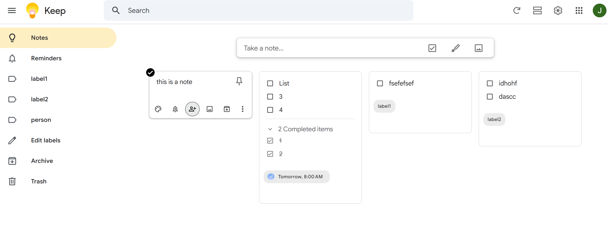
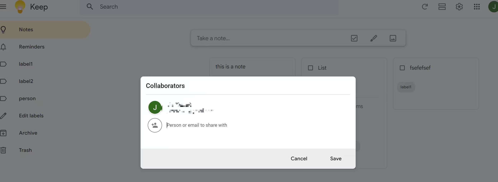
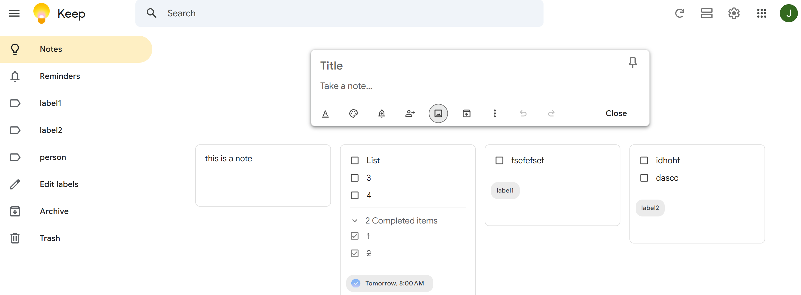

# Keep Evolution

ARC-Bench-Lite evolution requirements for the Keep note management system. The task starts from a completed Keep implementation from ARC-Bench-Lite and applies changed and new requirements based on real Google Keep behavior while preserving existing note creation, search, labels, archive, and settings behavior.

## REQ-7.1 Search by note type

Extend the existing suggested-search-filter panel so it can filter notes by note type. Reference image: . Seed data: ordinary note `Groceries`, checklist note `Packing checklist` with items `Passport` and `Charger`, and reminder note `Call dentist` with reminder `Tomorrow`. Add type filters named `Lists` and `Reminders`. Selecting `Lists` shows `Packing checklist` and hides ordinary text note `Groceries`; selecting `Reminders` shows `Call dentist` and hides notes without reminders.

**Type:** ATOMIC
**Dependencies:** REQ-3.1, REQ-8.1, REQ-8.2

**Scenarios:**

- Filter search results by note type
  - **GIVEN:** The user is on the Keep home page and the system contains Groceries, Packing checklist, and Call dentist.
  - **WHEN:** The user focuses the Search field and selects the Lists type filter.
  - **THEN:** Packing checklist is visible and Groceries is absent from the filtered notes list.
  - **WHEN:** The user selects the Reminders type filter.
  - **THEN:** Call dentist is visible and notes without reminders are absent from the filtered notes list.

## REQ-7.2 Control checked checklist item placement

Extend the existing detailed settings behavior so the `Move checked items to bottom` option controls checklist item placement. Reference image: . Seed data: `Packing checklist` contains unchecked items `Passport` followed by `Charger`. When the option is disabled, checking `Passport` keeps it before `Charger` while marking it completed; when enabled, checked items move below unchecked items.

**Type:** ATOMIC
**Dependencies:** REQ-4.2, REQ-8.1

**Scenarios:**

- Keep checked checklist items in place when the setting is disabled
  - **GIVEN:** The user has the Packing checklist note with unchecked Passport and Charger items in that order.
  - **WHEN:** The user opens Settings, disables Move checked items to bottom, saves, and checks Passport.
  - **THEN:** Passport remains before Charger and is marked completed.

## REQ-8.1 Checklist notes

Add support for checklist notes from the existing note editor. Reference image: . The `Note editor` must provide a checklist/list action, allow the title `Packing checklist` and two items `Passport` and `Charger`, and save the note. The saved note exposes both items as checkboxes; checking `Passport` keeps it visible as completed.

**Type:** ATOMIC
**Dependencies:** REQ-2.2, REQ-2.4

**Scenarios:**

- Create and check a checklist note
  - **GIVEN:** The user is on the Keep home page.
  - **WHEN:** The user creates a checklist note titled Packing checklist with items Passport and Charger and saves it.
  - **THEN:** The saved Packing checklist note displays both items with checkboxes.
  - **WHEN:** The user checks the Passport item.
  - **THEN:** Passport remains visible and is marked checked.

## REQ-8.2 Timed note reminders

Add timed reminders for notes. References:  and . Seed data: regular note `Call dentist` with content `Schedule a cleaning appointment.`. A user can set the reminder value `Tomorrow`; the note card must show a visible `Tomorrow` reminder chip and the note must appear in the `Reminders` sidebar view while preserving its title and content.

**Type:** ATOMIC
**Dependencies:** REQ-2.2, REQ-2.7.6.3

**Scenarios:**

- Set a Tomorrow reminder on a note
  - **GIVEN:** The user is on the home page and can see the Call dentist note.
  - **WHEN:** The user opens the reminder control for Call dentist and selects Tomorrow.
  - **THEN:** Call dentist displays a Tomorrow reminder chip and appears in the Reminders view.

## REQ-9.1 Share notes with collaborators

Add collaborator sharing for notes. References:  and . Seed data: note `Groceries`; collaborator email `teammate@example.com`. A user can open the note action menu, choose `Collaborator` or `Share`, enter the email, save, and reopen the dialog to see the collaborator attached to the note.

**Type:** ATOMIC
**Dependencies:** REQ-2.2

**Scenarios:**

- Add a collaborator to a note
  - **GIVEN:** The user is on the Keep home page and can see the Groceries note.
  - **WHEN:** The user opens actions for Groceries, chooses Collaborator, enters teammate@example.com, and saves.
  - **THEN:** Groceries shows collaborator information and teammate@example.com is visible when the dialog is reopened.

## REQ-9.2 Create image notes

Add image attachment support for notes. Reference image: . The `Note editor` must provide an image action and file input. A user can create note `Receipt photo` with content `Image attached for reimbursement.`, attach an image, and close the editor. The saved note card displays its title, text content, and an image preview.

**Type:** ATOMIC
**Dependencies:** REQ-2.2

**Scenarios:**

- Attach an image to a note
  - **GIVEN:** The user is on the Keep home page and can open the Note editor.
  - **WHEN:** The user creates Receipt photo, enters Image attached for reimbursement., chooses the image action, uploads a PNG image, and closes the editor.
  - **THEN:** The saved Receipt photo note displays its title, text content, and an image preview.
